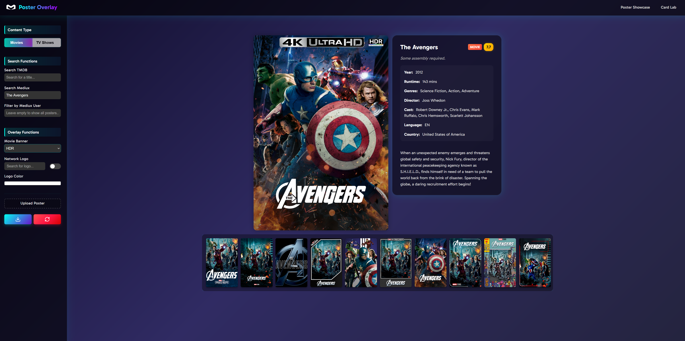
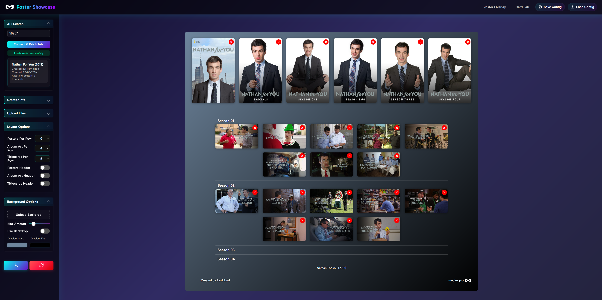

# Poster-Tools

A suite of advanced, browser-based tools for creating, customizing, and showcasing media posters, overlays, and title cards.

**Access online:** [https://poster-tools.pages.dev/](https://poster-tools.pages.dev/)

## Tool Suite Overview

Poster-Tools provides three powerful, privacy-friendly utilities for media creators and archivists:

- **Poster Overlay:** Add banners, streaming/network logos, and metadata overlays to your posters.
- **Card Lab:** Design and export highly customizable episode/season title cards.
- **Poster Showcase:** Build and export full showcase grids for posters, album art, and titlecards.

## 1. Poster Overlay

**URL:** [Poster Overlay](https://poster-tools.pages.dev/poster-overlay)

### Features:

- Upload your own poster image (JPG/PNG).
- Search for movies/TV shows via TMDB or Mediux for auto-filling metadata.
- Add overlay banners (4K, HDR, Dolby Vision, etc.).
- Search and add network logos, with color customization.
- Fine-tune overlays and logo placement.
- Download the final composited image.
- Reset to start over at any time.

### Advanced Usage:

- Use TMDB or Mediux search to auto-populate metadata and overlays.
- Filter Mediux posters by username for community poster curation.
- Combine multiple overlays and logos for complex branding.
- All rendering is client-side for privacy and speed.
- Supports high-resolution exports for print or digital use.

## 2. Card Lab

**URL:** [Card Lab](https://poster-tools.pages.dev/card-lab)

### Features:

- Search for a TV show and select a season/episode, or enter details manually.
- Upload a custom thumbnail or use the default.
- Full control over:
  - Episode/season numbers, series type, and separators.
  - Text position, font, size, color, shadow, and outline.
  - Info layout, spacing, and wrapping.
- Preset layouts for quick design.
- Save/load your card configuration for future editing.
- Download the finished card as a high-res PNG.

### Advanced Usage:

- Use TMDB search to instantly fill in episode/season data and artwork.
- Experiment with different font families and visual effects for unique branding.
- Toggle between grid and single-card view for batch or focused editing.
- Save multiple configurations locally for rapid iteration.
- Supports advanced typography and layout for professional results.

## 3. Poster Showcase

**URL:** [Poster Showcase](https://poster-tools.pages.dev/poster-showcase)

### Features:

- Connect to an API (optional) to fetch show sets by ID.
- Add creator info, custom footer, and clear logo.
- Upload multiple posters, album art, and titlecards.
- Upload a custom background and adjust blur/gradient.
- Control the number of items per row for each section.
- Show/hide section headers for a clean or detailed look.
- Download the entire showcase as a single image.
- Reset to clear all uploads and settings.

### Advanced Usage:

- Use the API connection to auto-populate large sets for batch showcase creation.
- Fine-tune layout for social media, portfolio, or archival purposes.
- Combine custom backgrounds, gradients, and logos for branded presentations.
- Export high-resolution grids for print or digital use.
- Supports creator branding and metadata for professional archiving.

## Tips & Advanced Workflows

- **Batch Processing:** Use Card Lab and Poster Overlay in tandem to create consistent sets, then assemble them in Poster Showcase.
- **Branding:** Leverage custom fonts, overlays, and network logos to match your or your community's style.
- **Collaboration:** Share saved configurations or exported images with collaborators for feedback or further editing.
- **Privacy:** All tools run entirely in your browser—no uploads or data are sent to a server (except for TMDB/Mediux API queries).
- **Performance:** Designed for fast, high-res exports even with large grids or complex overlays.
- **API Integration:** Poster Showcase can connect to external APIs for automated set population, supporting advanced workflows for archivists and curators.
- **Accessibility:** All tools are keyboard-navigable and support high-contrast themes for accessibility.

## Troubleshooting & FAQ

- **Exported images look blurry:** Ensure you are using high-resolution source images and exporting at the default or higher canvas size.
- **Fonts not displaying correctly:** Some custom fonts may not be available on all systems; use web-safe or embedded fonts for best results.
- **Browser compatibility:** Poster-Tools is tested on the latest versions of Chrome, Firefox, and Edge. For best results, use a modern browser.
- **Data privacy:** All processing is local to your browser. Only TMDB/Mediux API queries are sent externally.

## License

This project is licensed under the MIT License. See the LICENSE file for details.
